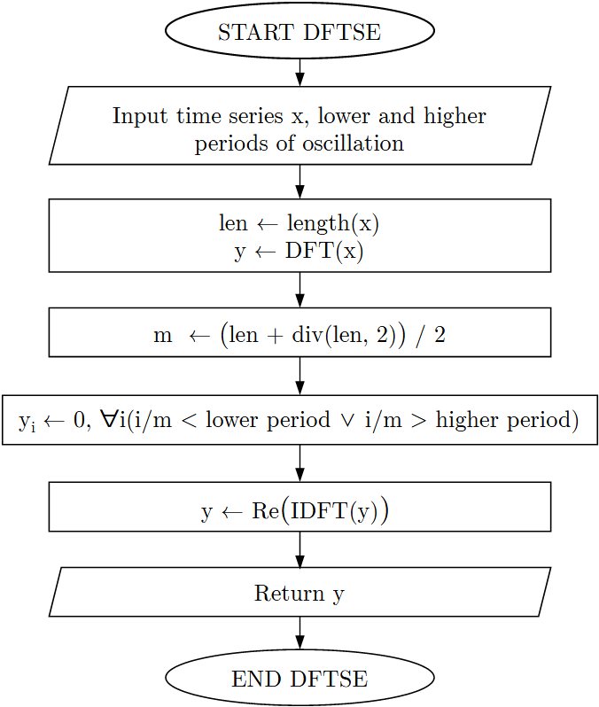
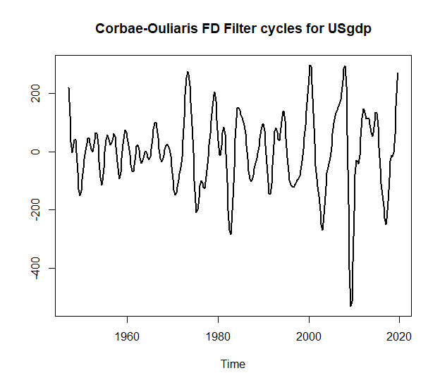

```{r setup, include=FALSE}
knitr::opts_chunk$set(echo = TRUE, eval=FALSE)
```

# **Corbae and Ouliaris ([2006](#ref-corbae2006)) Frequency Domain Filter in R**

## **Corbae-Ouliaris Frequency Domain Filtering**

Corbae and Ouliaris ([2006](#ref-corbae2006)) Frequency
Domain Filter is used for extracting cycles from either both on stationary and
non-stationary time series. This is one approximation of the ideal band pass
filter of the series. The result is close to the one of the Baxter-King
([1999](#ref-baxter1999)) filter, but end-points are directly estimated and so
facing the end-point issue is not faced.

The main idea of this filtering algorithm is illustrated
in Fig. [1](#ref-Figure1) and [2](#ref-Figure2). The main idea of the DFTSE
subroutine is shown in Fig. [1](#ref-Figure1), where DFT (Discrete
Fourier Transform) of the times series, then frequencies lower and higher
by periods of oscillation thresholds are assigned to zero and finally IDFT
(Inverse Discrete Fourier Transform) are performed. Additional implementation
details of this subroutine can be found at source code of the function
`corbouli::dftse`.

<p align="center">
    
</p>
<p class="caption" align="center">
<span id="ref-Figure1"></span>Fig. 1: DFTSE subroutine.
</p>

The final algorithm is described in Fig. [2](#ref-Figure2),
where filtered series is the residuals of the regression of $DFTSE(x)$ on
$DFTSE$ of the normalized trend.

<p align="center">
    
</p>
<p class="caption" align="center">
<span id="ref-Figure2"></span>Fig. 2: Corbae-Ouliaris main algorithm.
</p>

The minimum and the maximum periods of oscillation should be determined when
using this method, so as to irrelevant to filtering frequencies are removed.
As an example from Shaw ([1947](#ref-shaw1947)), a business cycle usually has
a lower period of 1.5 years and a higher period of 8 years. This information can
be used while for filtering as expressed from the following
Table [1](#ref-table1).

<table style="width: 368px; vertical-align: middle;
text-align: center; margin-left: auto; margin-right: auto;" border="1"
align="center">
<tbody>
<tr style="height: 26.75px;">
<td style="width: 136.65px; height: 26px;" align="center">
                                              &nbsp;<b>Sample Frequency</b></td>
<td style="width: 136.65px; height: 26px;" align="center"><b>Lower</b></td>
<td style="width: 136.65px; height: 26px;" align="center"><b>Higher</b></td>
</tr>
<tr style="height: 26px;" align="center">
<td style="width: 136.65px; height: 26px;" align="center">
                                                         &nbsp;<b>Month</b></td>
<td style="width: 136.65px; height: 26px;" align="center">18</td>
<td style="width: 136.65px; height: 26px;" align="center">96</td>
</tr>
<tr style="height: 26px;" align="center">
<td style="width: 136.65px; height: 26px;" align="center">
                                                       &nbsp;<b>Quarter</b></td>
<td style="width: 136.65px; height: 26px;" align="center">6</td>
<td style="width: 136.65px; height: 26px;" align="center">32</td>
</tr>
<tr style="height: 26px;" align="center">
<td style="width: 136.65px; height: 26px;" align="center">&nbsp;<b>Year</b></td>
<td style="width: 136.65px; height: 26px;" align="center">2</td>
<td style="width: 136.65px; height: 26px;" align="center">8</td>
</tr>
</tbody>
</table>
<p align="center">
  <span class="nocase" id="ref-table1">
    Table 1: Lower and higher periods of oscillation.
  </span>
</p>

The same table in fragments of $\pi$ can be transformed into the Table
[2](#ref-table2) using the $lower\ frequency = 2 / higher\ period$ and
$higher\ frequency = 2 / lower\ period$. For instance, for quarterly sampled
time series, we have $lower\ frequency = 2 / 32 = 0.0625$ and
$higher\ frequency = 2 / 6 = 0.3333$.

<table style="width: 368px; vertical-align: middle;
text-align: center; margin-left: auto; margin-right: auto;" border="1"
align="center">
<tbody>
<tr style="height: 26.75px;">
<td style="width: 136.65px; height: 26.75px;" align="center">
                                              &nbsp;<b>Sample Frequency</b></td>
<td style="width: 136.65px; height: 26.75px;">&nbsp;<b>Lower</b></td>
<td style="width: 136.65px; height: 26.75px;"><b>Higher</b></td>
</tr>
<tr style="height: 26px;" align="center">
<td style="width: 136.65px; height: 26px;" align="center">
                                                         &nbsp;<b>Month</b></td>
<td style="width: 136.65px; height: 26px;" align="center">0.0208</td>
<td style="width: 136.65px; height: 26px;" align="center">0.1111</td>
</tr>
<tr style="height: 26px;" align="center">
<td style="width: 136.65px; height: 26px;" align="center">
                                                       &nbsp;<b>Quarter</b></td>
<td style="width: 136.65px; height: 26px;" align="center">0.0625</td>
<td style="width: 136.65px; height: 26px;" align="center">0.3333 </td>
</tr>
<tr style="height: 26px;" align="center">
<td style="width: 136.65px; height: 26px;" align="center">&nbsp;<b>Year</b></td>
<td style="width: 136.65px; height: 26px;" align="center">0.25</td>
<td style="width: 136.65px; height: 26px;" align="center">1</td>
</tr>
</tbody>
</table>
<p align="center">
  <span class="nocase" id="ref-table2">
    Table 2: Low and high frequency in fragments of $\pi$.
  </span>
</p>

The longer the series, the more the long run frequency is expressed by a
lower frequency as fragment of $\pi$ equal to 0. Moreover, the output gap can be
expressed using higher frequency as fragment of $\pi$ equal to 1
([Ouliaris, 2009](#ref-ouliaris2009)).

## **Example**

For this example, the quarterly US GDP in billions of chained 2017 dollars
(Seasonally adjusted) will be used.

``` r
# Import package to workspace
library(corbouli)

# Import "USgdp" dataset
data(USgdp)

plot(USgdp, main = "Quarterly US GDP in billions of chained 2017 dollars
(Seasonally adjusted)", ylab = "", lwd  = 2)
```

<p align="center">
    
</p>
<p class="caption" align="center">
<span id="ref-Figure3"></span>Fig. 3: USgdp dataset.
</p>

```r
# Extract cycles
co <- corbae_ouliaris(USgdp, low_freq = 0.0625, high_freq = 0.3333)

# Plot cycles of filtered series
plot(co,
     main = "Corbae-Ouliaris FD Filter cycles for USgdp",
     ylab = "",
     lwd  = 2)
```

<p align="center">
    
</p>
<p class="caption" align="center">
<span id="ref-Figure4"></span>Fig. 4: Corbae-Ouliaris FD Filter cycles.
</p>

```r
# Plot real data with the ones after removing cycles
# Removing cycles from original data
USgdp_rmco <- USgdp - co

# Plot Original vs Decycled data
plot(USgdp, main = "Quarterly US GDP in billions of chained 2017 dollars
(Seasonally adjusted)", col = "black", lwd = 2, ylab = "")
lines(USgdp_rmco, col = adjustcolor("red", alpha.f = 0.7), lwd = 2)
legend(x = "topleft", lwd = 2, text.font = 2,
       col= adjustcolor(c("black","red"), alpha.f = 0.7),
       legend=c("Original data", "Decycled data"))
```
<p align="center">
    
</p>
<p class="caption" align="center">
<span id="ref-Figure5"></span>Fig. 5: Original vs Decycled USgdp data.
</p>

As noted by Ouliaris ([2009](#ref-ouliaris2009)), for setting `high_freq = 1`
the output gap series than business cycle one will have higher volatility (Fig.
[6](#ref-Figure6)).

```r
# Extract output gap
og <- corbae_ouliaris(USgdp, low_freq = 0.0625, high_freq = 1)

# Plot Business cycle vs Output gap
plot(co, main = "Business cycle vs Output gap for USgdp",
     col = adjustcolor("blue", alpha.f = 0.7), lwd = 2, ylab = "")
lines(og, col = adjustcolor("orange", alpha.f = 0.7), lwd = 2)
legend(x = "bottomleft", lwd = 2, text.font = 2,
       col= adjustcolor(c("blue","orange"), alpha.f = 0.7),
       legend=c("Business cycle", "Output gap"))
```

<p align="center">
    
</p>
<p class="caption" align="center">
<span id="ref-Figure6"></span>Fig. 6: Business cycle vs Output gap.
</p>

## **References**

Baxter, M., & King, R. (1999), <span class="nocase" id="ref-baxter1999">
Measuring Business Cycles: Approximate Band-Pass Filters for Economic Time
Series.</span> <em>Review of Economics and Statistics</em> <b>81</b>(4), pp.
575-593.

Corbae, D., Ouliaris, S., & Phillips, P. (2002),
<span class="nocase" id="ref-corbae2002"> Band Spectral Regression with
Trending-Data. <em>Econometrica</em> <b>70</b>(3), pp. 1067-1109.

Corbae, D. & Ouliaris, S. (2006),<span class="nocase" id="ref-corbae2006">
Extracting Cycles from Nonstationary Data,</span>in Corbae D., Durlauf S.N.,
& Hansen B.E. (eds.). <em>Econometric Theory and Practice: Frontiers of
Analysis and Applied Research</em>. Cambridge: Cambridge University Press, pp.
167–177. 
doi:<a href=
"https://doi.org/10.1017/CBO9781139164863.008">10.1017/CBO9781139164863.008</a>

Ouliaris, S. (2009), <span class="nocase" id="ref-ouliaris2009">Ideal Band Pass
Filter For Stationary/Non-Stationary Series.</span>

Pérez Pérez, J. (2011), <span class="nocase" id="ref-perez2011">COULIARI: Stata
module to implement Corbae-Ouliaris frequency domain filter to time series
data.</span> <em>Statistical Software Components</em>, S457218, Boston College
Department of Economics.

Shaw, E.S. (1947), <span class="nocase" id="ref-shaw1947">Burns and Mitchell on
Business Cycles.</span> <em>Journal of Political Economy</em>, <b>55</b>(4):
pp. 281-298. 
doi:<a href="https://doi.org/10.1086/256533">10.1086/256533</a>
